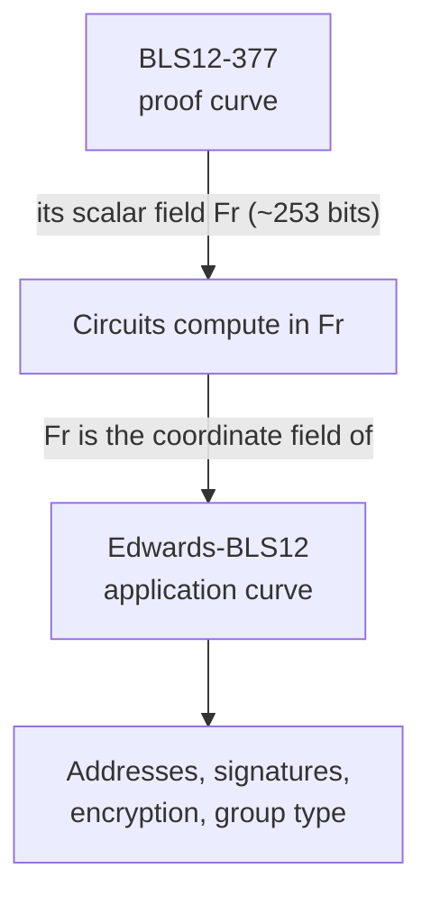
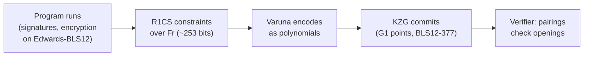
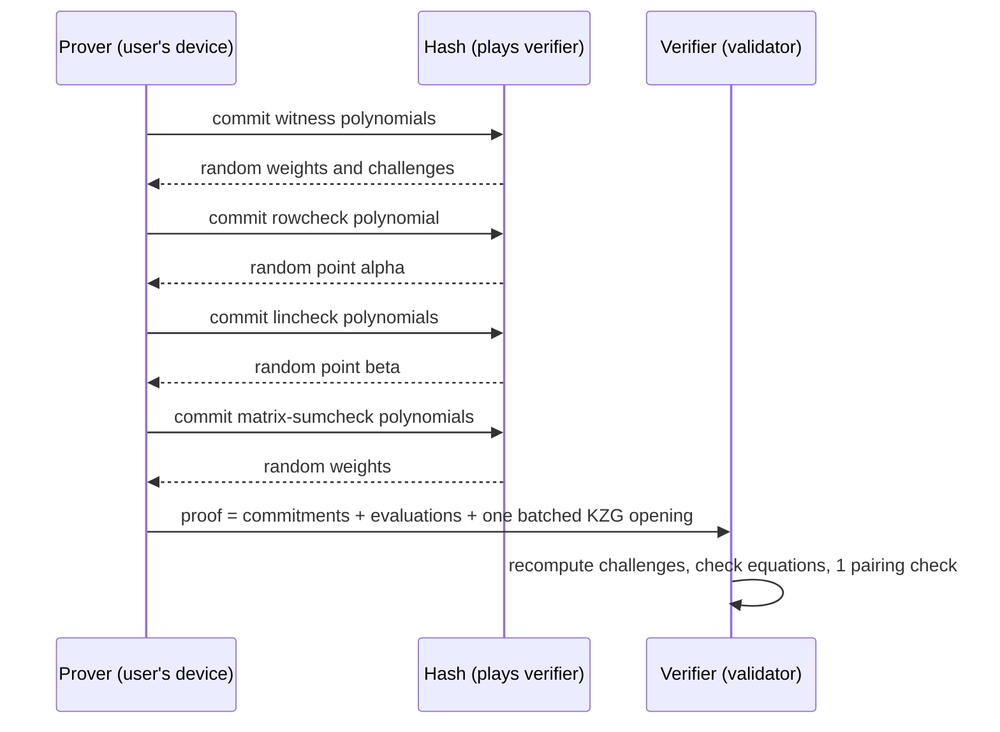

# Learning Notes 01: BLS12-377, Edwards-BLS12, Pairings, KZG and Varuna

> Snapshot of the living doc (24–25 Sep 2026). The editable original, with comments, is
> [Learning Notes 01 on claude.ai](https://claude.ai/code/artifact/2d7e97dc-ad20-4e51-9461-36707dc6913f).
> Code paths are relative to the [snarkVM](https://github.com/ProvableHQ/snarkVM) repository.

## Contents

1. [Why these four ideas matter](#why-these-four-ideas-matter)
2. [BLS12-377: the proof curve](#bls12-377-the-proof-curve)
3. [Edwards-BLS12: the application curve](#edwards-bls12-the-application-curve)
4. [Pairings: checking multiplication in the dark](#pairings-checking-multiplication-in-the-dark)
5. [KZG commitments: a whole polynomial in one point](#kzg-commitments-a-whole-polynomial-in-one-point)
6. [How it fits together in snarkVM](#how-it-fits-together-in-snarkvm)
7. [Cheat sheet and self-check](#cheat-sheet-and-self-check)
8. [Varuna in one picture](#varuna-in-one-picture)
9. [Step 1: from R1CS to polynomials](#step-1-from-r1cs-to-polynomials)
10. [Step 2: indexing, the circuit becomes its verifying key](#step-2-indexing-the-circuit-becomes-its-verifying-key)
11. [Step 3: the five prover rounds](#step-3-the-five-prover-rounds)
12. [Step 4: Fiat–Shamir, a hash playing the verifier](#step-4-fiatshamir-a-hash-playing-the-verifier)
13. [Step 5: openings, the pairing check, and why one point is enough](#step-5-openings-the-pairing-check-and-why-one-point-is-enough)
14. [Zero-knowledge and batching](#zero-knowledge-and-batching)
15. [Varuna code map and self-check](#varuna-code-map-and-self-check)
16. [State models: accounts, UTXOs, and Aleo's hybrid](#state-models-accounts-utxos-and-aleos-hybrid)

---

## Why these four ideas matter

snarkVM uses two curves for two different jobs, and pairings plus KZG are what turn one of those curves into a proof system. Everything a program touches lives on Edwards-BLS12; everything about the proof lives on BLS12-377.

| Idea | One-line job | Where it shows up in snarkVM |
| --- | --- | --- |
| BLS12-377 | The "proof curve": supports pairings | Varuna proofs, verifying keys, the universal SRS |
| Edwards-BLS12 | The "application curve": cheap inside circuits | Addresses, signatures, record encryption, the `group` type |
| Pairing | A special map that lets a verifier check multiplications hidden inside curve points | The final check in every Varuna proof verification |
| KZG commitment | Commit to a whole polynomial with one curve point, then prove its value at any point | How Varuna commits to its polynomials |

The chain of dependence: BLS12-377 has pairings → pairings make KZG possible → KZG makes Varuna's proofs small → small proofs let validators verify instead of re-executing.

## BLS12-377: the proof curve

BLS12-377 is a pairing-friendly elliptic curve, chosen so that a second, fast curve can be built on top of it. It was designed by the Zexe research team (2018–20), the same line of research Aleo grew out of.

**The name, decoded**

- **BLS** = Barreto–Lynn–Scott, the family of curves it belongs to. (Not the BLS *signature* scheme, which is a different thing with the same initials.)
- **12** = the "embedding degree". It says how big the field is where pairing results land (12 times bigger than the base field). Higher means more secure pairings but slower ones; 12 is the common sweet spot.
- **377** = the base field is about 377 bits.

**Two fields, keep them apart**

Every elliptic curve has two numbers attached, and snarkVM code constantly switches between them:

| Field | Size on BLS12-377 | What it is | In snarkVM |
| --- | --- | --- | --- |
| Base field (Fq) | ~377 bits | Coordinates of points on the curve | Rarely seen directly by programs |
| Scalar field (Fr) | ~253 bits | Numbers you multiply points by | The Aleo `field` type; everything circuits compute on |

The scalar field is the one that matters most: all R1CS constraints, all witnesses and the Aleo `field` type live there.

**Key features**

- **Pairing-friendly.** Supports an efficient pairing (next section), which KZG and Varuna need.
- **High 2-adicity.** Its scalar field has a very large power-of-two subgroup (2^47). That lets FFTs run over huge domains, which is what polynomial-based provers do all day.
- **Has an embedded curve.** Its scalar field is a good base for a twisted Edwards curve (Edwards-BLS12), so application crypto can run cheaply inside proofs.
- **Designed for recursion.** Its base field matches the scalar field of another curve (BW6-761), so proofs could in principle be verified inside other proofs. snarkVM doesn't use BW6-761 today, but it's why the curve looks the way it does.
- **Security.** About 128 bits classically (published estimates sit a little under that). Broken by a large quantum computer, like every curve.

## Edwards-BLS12: the application curve

Edwards-BLS12 is a twisted Edwards curve whose coordinates are numbers in BLS12-377's *scalar* field, so its arithmetic is native inside Aleo circuits. It's called an **embedded curve**: a curve built to live inside another curve's proof system.

**Why a curve inside a curve**

A circuit can only do arithmetic in BLS12-377's scalar field (~253 bits). If Aleo addresses used BLS12-377 points directly, their coordinates would be ~377-bit base-field numbers. Every signature check inside a proof would then need "foreign-field" emulation, which costs thousands of extra constraints per operation. Edwards-BLS12's coordinates *are* scalar-field numbers, so adding two points is just a few field multiplications in the circuit.



The proof curve's number system becomes the application curve's coordinate system; that's the whole trick.

**Key features**

- **Complete addition formula.** One formula adds any two points, including doubling and the identity, with no special cases. In a circuit that means no branches, which is cheaper and avoids a class of bugs.
- **Twisted Edwards form** (a·x² + y² = 1 + d·x²·y²). This is the fastest-known shape for addition, and the same family as Ed25519.
- **Cofactor 4.** The full group is 4 times bigger than the prime-order subgroup Aleo uses. Code must "clear the cofactor" in places; that's why you see `mul_by_cofactor()` in the serial-number code.
- **Not pairing-friendly, and doesn't need to be.** It's only used for application crypto, never for the proof system itself.
- **Two Aleo types map onto it.** `group` = a point on this curve. `scalar` = a number in its own (~251-bit) scalar field, used to multiply points.

**What runs on it**

| Use | Operation on Edwards-BLS12 |
| --- | --- |
| Address | `address = G · view_key` |
| Signature (the Aleo Schnorr-style signature) | Checked inside the circuit on every request |
| Record encryption | Diffie–Hellman: `record view key = (owner · randomizer).x` |
| Commitments and hashes (BHP, Pedersen) | Sums of fixed curve points |
| Serial numbers | `gamma = sk_sig · HashToGroup(commitment)` |

## Pairings: checking multiplication in the dark

A pairing lets a verifier check that hidden numbers multiply correctly, using only the curve points that hide them. That single ability is what makes KZG, and therefore Varuna, work.

**The problem it solves**

On a curve you can hide a number `a` as the point `a·G`. From hidden points you can already check *addition*: `a·G + b·G = (a+b)·G`. But you can't check *multiplication*. Given `a·G` and `b·G`, nobody can compute `(a·b)·G`. That's the discrete-log hardness that makes curves useful, and it also blocks verification of anything non-linear.

**What a pairing does**

A pairing `e` takes two points and outputs an element of a third group, with one magic rule:

```
e(a·G1, b·G2) = e(G1, G2)^(a·b)
```

The `a` and `b` "come out" and multiply in the exponent. So to check that hidden values satisfy `a · b = c`, the verifier checks `e(a·G1, b·G2) = e(c·G1, G2)` and never learns a, b or c. You get exactly **one multiplication** per check: the output lives in a different group, so you can't pair again.

**The three groups**

| Group | What it is on BLS12-377 | Point size |
| --- | --- | --- |
| G1 | Points on the curve over the base field | Small (~48 bytes compressed) |
| G2 | Points on a "twisted" copy over an extension field | ~2× bigger, slower |
| GT | The output: elements of a 12-degree extension field (the "12" in BLS12) | Large; only used inside the check |

Protocols put as much as possible in G1 because it's cheapest. In KZG, commitments and proofs are G1 points; G2 holds just a couple of setup points.

**Features and costs**

- **Bilinear:** linear in each input, the rule above.
- **Non-degenerate:** doesn't send everything to 1, so the check is meaningful.
- **Expensive:** one pairing costs roughly as much as hundreds of ordinary point operations. Verifiers batch many checks into a small number of pairings (a "multi-pairing").
- **Only on special curves:** most curves (Ed25519, secp256k1, Edwards-BLS12) have no efficient pairing. Curves like BLS12-377 and BN254 are built to have one.
- **Quantum-vulnerable:** relies on discrete logs being hard.

## KZG commitments: a whole polynomial in one point

KZG (Kate–Zaverucha–Goldberg, 2010) lets a prover commit to a polynomial with a single curve point, then prove its value at any point with one more curve point. The verifier checks it with two pairings, whatever the polynomial's size.

**Why polynomials at all**

Proof systems like Varuna turn "all constraints are satisfied" into "some polynomials satisfy an identity". Checking an identity is easy if you pick a random point: two *different* polynomials of degree d agree on at most d points, out of about 2^253 possible points. So "f(r) = g(r) at a random r" is overwhelming evidence that f = g. KZG is the tool that lets the verifier learn f(r) without ever seeing f.

**The four steps (intuition)**

1. **Setup (once, shared by everything).** A ceremony picks a secret number τ (tau) and publishes `G, τ·G, τ²·G, …, τⁿ·G` plus `τ·G2`. Then τ is destroyed. This list is the **SRS** (structured reference string).
2. **Commit.** For a polynomial f, the prover computes `C = f(τ)·G` by combining the SRS points with f's coefficients. Nobody knows τ, yet C is "f evaluated at the secret point". That's one G1 point, even if f has a million coefficients.
3. **Open at z.** To prove `f(z) = y`, the prover divides: `q(x) = (f(x) − y) / (x − z)`. This division only works cleanly if f(z) really equals y. The proof is `π = q(τ)·G`, one more G1 point.
4. **Verify.** One pairing equation checks that the division was honest:

```
e(C − y·G, G2) = e(π, τ·G2 − z·G2)
```

In words: "f(τ) − y really equals q(τ)·(τ − z)", checked in the exponent, which is exactly the one multiplication a pairing allows.

**Features**

- **Constant size:** a commitment is one G1 point (~48 bytes) and an opening proof is one G1 point, for any degree.
- **Constant verification:** two pairings, which stays fast however big the circuit is.
- **Batching:** many openings of many polynomials can be folded into one check with random weights. Varuna relies on this heavily.
- **Additive (homomorphic):** `commit(f) + commit(g) = commit(f + g)`, which enables batching and combining.
- **Universal setup:** one SRS serves every circuit up to its size limit. That's why deploying a new Aleo program needs no new ceremony.
- **Hiding variant:** plain KZG isn't zero-knowledge, since the commitment is deterministic. snarkVM uses a hiding variant (`sonic_pc` on `kzg10`) that mixes in randomness.

**Trade-offs**

- **Trusted setup:** if anyone kept τ, they could forge proofs. Multi-party ceremonies make this safe as long as *one* participant destroyed their share.
- **Maximum degree:** the SRS has a fixed length, so it caps circuit size.
- **Prover cost:** each commitment is a big multi-scalar multiplication (MSM), the dominant proving cost.
- **Not post-quantum:** relies on pairings and discrete logs.

**KZG vs the alternatives**

| Scheme | Commitment / proof size | Verifier cost | Setup | Post-quantum |
| --- | --- | --- | --- | --- |
| KZG (snarkVM today) | Constant, ~48 bytes each | 2 pairings | Trusted, universal | No |
| FRI (STARKs) | Tens to hundreds of KB | Many hashes | Transparent (none) | Yes |
| IPA / Bulletproofs-style | Logarithmic | Linear in size | Transparent | No |

## How it fits together in snarkVM

Edwards-BLS12 does the application work inside the circuit, and BLS12-377 plus KZG and pairings prove that circuit was satisfied.



The user's device runs the left three boxes and the commitments; every validator runs only the last box.

| Concept | Code |
| --- | --- |
| BLS12-377 (fields, G1, G2, pairing) | `curves/src/bls12_377/` (`fr.rs` has `TWO_ADICITY = 47`) |
| Edwards-BLS12 | `curves/src/edwards_bls12/` (`parameters.rs` has `COFACTOR = 4`) |
| Aleo `field`, `group`, `scalar` types | `console/types/{field,group,scalar}` and their `circuit/types` twins |
| Which curve a network uses | `console/network/src/mainnet_v0.rs` (`PairingCurve`, Edwards coefficients) |
| KZG | `algorithms/src/polycommit/kzg10/` |
| Hiding, batched KZG used by Varuna | `algorithms/src/polycommit/sonic_pc/` |
| Varuna (uses the above) | `algorithms/src/snark/varuna/` |
| The SRS (the τ powers) | `algorithms/src/srs/`, loaded by `parameters/` |
| MSM, the cost of committing | `algorithms/src/msm/` |

## Cheat sheet and self-check

| Term | Remember it as |
| --- | --- |
| BLS12-377 | The proof curve. Has pairings. Its scalar field is Aleo's `field`. |
| Edwards-BLS12 | The application curve, embedded in BLS12-377's scalar field so it's cheap in circuits. |
| Pairing | Checks one hidden multiplication: `e(a·G1, b·G2) = e(G1, G2)^(a·b)`. |
| KZG | A whole polynomial becomes one point; any evaluation is proven with one more point; two pairings to check. |
| SRS | Powers of a secret τ, made once in a ceremony, shared by every circuit. |

**Check yourself**

- [ ] Why can't Aleo addresses just use BLS12-377 points? (Hint: which field do circuits compute in?)
- [ ] Which field is Aleo's `field` type: base or scalar field of BLS12-377?
- [ ] Why can a pairing check only one multiplication, not two?
- [ ] If someone kept τ from the ceremony, what could they do? What couldn't they do?
- [ ] Why does `(f(x) − y)` divide evenly by `(x − z)` only when `f(z) = y`?
- [ ] Which of these four pieces would change for post-quantum Aleo, and to what?

## Varuna in one picture

Varuna proves "I know a witness that satisfies this R1CS" by rewriting the constraints as polynomial equations, committing to those polynomials with KZG, and letting the verifier spot-check them at random points. It's snarkVM's own evolution of Marlin (2019), and its code README calls it a "preprocessing zkSNARK for R1CS with universal and updatable SRS".

**Three ingredients**

| Ingredient | Role | In one sentence |
| --- | --- | --- |
| AHP (algebraic holographic proof) | The logic | An interactive game where the prover sends polynomials and the verifier asks for their values at random points. |
| Polynomial commitment (KZG, `sonic_pc`) | The glue | Makes "sending a polynomial" cost one curve point, and "asking a value" cost one opening proof. |
| Fiat–Shamir (Poseidon sponge) | The trick | Replaces the verifier's random questions with hashes, so the game becomes a single message: the proof. |



The prover does all the heavy work alone; the verifier only replays the hashes and does a handful of field operations plus one batched pairing check.

## Step 1: from R1CS to polynomials

R1CS says `(A·z) ∘ (B·z) = C·z`, and Varuna turns that into "one polynomial is divisible by another". Here ∘ means multiply entry by entry, and `z` is the full assignment.

**A worked example**

Prove you know `x` with `x³ + x + 5 = 35` (answer: x = 3). The assignment vector is `z = (1, 35, x, v1, v2) = (1, 35, 3, 9, 27)`. The first two entries are public; the rest is the secret witness `w`.

| Constraint | A·z (left) | B·z (right) | C·z (output) | Check |
| --- | --- | --- | --- | --- |
| 1: x · x = v1 | x = 3 | x = 3 | v1 = 9 | 3 · 3 = 9 |
| 2: v1 · x = v2 | v1 = 9 | x = 3 | v2 = 27 | 9 · 3 = 27 |
| 3: (v2 + x + 5) · 1 = 35 | 35 | 1 | 35 | 35 · 1 = 35 |

Each row of A, B and C picks which variables go into that constraint. So `A·z = (3, 9, 35)`, `B·z = (3, 3, 1)` and `C·z = (9, 27, 35)`.

**Turning columns into polynomials**

1. Pick a set of points H, one per constraint. In practice H is a power-of-two set of "roots of unity", so FFTs work (that's why BLS12-377's 2-adicity matters). Here H would have 4 points, padded from 3.
2. Draw the smooth curve through each column. `z_A(X)` is the polynomial with `z_A(h₁) = 3`, `z_A(h₂) = 9`, `z_A(h₃) = 35`. Same for `z_B` and `z_C`.
3. Now "every constraint holds" means `z_A(h)·z_B(h) − z_C(h) = 0` at every point h in H.

**The divisibility trick (rowcheck)**

A polynomial is zero at every point of H exactly when it's divisible by the *vanishing polynomial* `v_H(X) = X^|H| − 1`, which is zero precisely on H. So the prover shows:

```
z_A(X) · z_B(X) − z_C(X) = h_0(X) · v_H(X)
```

The quotient `h_0` exists only if all constraints hold. If even one constraint fails, the division leaves a remainder and no honest `h_0` exists.

**What's still missing**

The rowcheck only proves the three columns multiply correctly. It doesn't prove they came from the real matrices A, B, C applied to the real `z`. That second check is the **lincheck**, covered in Step 3.

## Step 2: indexing, the circuit becomes its verifying key

Indexing encodes the circuit's matrices A, B, C as polynomials once, and commits to them; those commitments *are* the verifying key. This happens when an Aleo program is deployed, one index per function.

**Why it's needed ("holography")**

A real circuit has hundreds of thousands of constraints. If the verifier had to read A, B and C, verification would be as slow as the computation. Instead the verifier holds only commitments to the matrices and asks for a few values at random points. "Holographic" means exactly this: the verifier sees the circuit only through commitments.

**What the indexer builds**

A, B, C are sparse: most entries are zero. For each matrix, Varuna lists only the non-zero entries and encodes them with a few polynomials over a third domain K (one point per non-zero entry):

| Polynomial | Encodes, for the k-th non-zero entry |
| --- | --- |
| `row(X)` | Which row (constraint) it's in |
| `col(X)` | Which column (variable) it's in |
| `row_col(X)` | row × col, precomputed to save work later |
| `val(X)` / `row_col_val(X)` | The entry's value (combined with row and col) |

The code comment in `ahp/indexer/circuit.rs` says it directly: "Compute the row, col, rowcol and rowcolval polynomials of the three matrices".

**The three domains**

| Domain | Size = | Used for |
| --- | --- | --- |
| Constraint domain (H) | number of constraints, rounded to a power of 2 | rowcheck: z_A, z_B, z_C |
| Variable domain | number of variables, rounded up | the assignment z and witness w |
| Non-zero domain (K) | non-zero matrix entries, rounded up | the matrix polynomials above |

**Keys that come out**

- **Verifying key** (`CircuitVerifyingKey`): circuit size info, KZG commitments to the index polynomials, and a circuit ID. Small, and stored on chain in the deployment.
- **Proving key**: the verifying key plus the full index polynomials and precomputed FFT data, so the prover can compute quickly. Large, kept off chain.

The verifying key's commitments are also fed into the Fiat–Shamir hash first (Step 4), so a proof is bound to one specific circuit.

## Step 3: the five prover rounds

The prover runs five rounds, each committing new polynomials and receiving new random challenges; together they chain three checks: rowcheck → lincheck → matrix sumcheck. Round names and polynomial names below match `ahp/prover/round_functions/first.rs … fifth.rs`.

| Round | Prover commits | What it's for | Challenge returned |
| --- | --- | --- | --- |
| 1 | `w` (witness) per instance, `mask_poly` | Fix the secret assignment before any challenge is known | Batch combiners: random weights per circuit and per instance |
| 2 | `h_0` | Rowcheck: `z_A·z_B − z_C = h_0·v_H` (Step 1) | `alpha` (a random point), `eta_b`, `eta_c` |
| 3 | `g_1`, `h_1`, plus claimed sums | Lincheck: z_A, z_B, z_C really equal A·z, B·z, C·z at `alpha` | `beta` (a second random point) |
| 4 | `g_a`, `g_b`, `g_c` per circuit | Matrix sumcheck: evaluate the committed matrices at (`alpha`, `beta`) | `delta_a`, `delta_b`, `delta_c` (weights) |
| 5 | `h_2` | Final quotient that ties the matrix sumchecks together | (then the opening queries) |

**The chain of reasoning, in plain words**

1. **Rowcheck (round 2).** "The three columns multiply correctly at every constraint." Reduced to one equation at the random point `alpha`, so the verifier needs `z_A(alpha)`, `z_B(alpha)`, `z_C(alpha)`.
2. **Lincheck (round 3).** Varuna never commits z_A, z_B, z_C directly. The prover instead claims their values at `alpha` and proves each one equals "row `alpha` of the matrix times z", a sum over all variables: `z_A(alpha) = Σⱼ A(alpha, j) · z(j)`. The three claims are merged with the weights `eta_b`, `eta_c`.
3. **Univariate sumcheck (the tool inside round 3).** To prove a sum over a domain equals σ, the prover shows the summed polynomial splits as `f(X) = h_1(X)·v(X) + X·g_1(X) + σ/|domain|`. That's where `g_1` and `h_1` come from. The check again happens at a random point, `beta`.
4. **Matrix sumcheck (rounds 4–5).** The lincheck left one unknown: A(`alpha`, `beta`), a single entry of the "matrix polynomial". The verifier can't compute it (it only holds commitments), so the prover proves it with another sumcheck, this time over the non-zero entries, using the index polynomials from Step 2. That produces `g_a`, `g_b`, `g_c` and `h_2`.

Each check hands a smaller claim to the next, until everything reduces to "these committed polynomials have these values at these random points". Only KZG openings remain (Step 5).

## Step 4: Fiat–Shamir, a hash playing the verifier

Fiat–Shamir replaces each random challenge with a hash of everything said so far. The five-round conversation becomes one message the prover can compute alone and anyone can check later.

**Why randomness must come after commitments**

The spot-check in every round only works if the prover couldn't predict the random point before committing. If a cheater knew `alpha` in advance, they could craft a fake `h_0` that happens to satisfy the equation at `alpha` alone. Hashing the commitments to produce `alpha` guarantees the commitments were fixed first: change any commitment and `alpha` changes completely.

**What goes into the hash, in order** (from `varuna.rs`)

1. The protocol name, so hashes from other protocols can't be reused.
2. The batch sizes and every **public input**.
3. The **verifying key**: circuit info, index commitments, circuit ID. This binds the proof to one circuit.
4. Round 1 commitments → squeeze the batch combiners.
5. Round 2 commitment → squeeze `alpha`, `eta_b`, `eta_c`.
6. Round 3 commitments + claimed sums → squeeze `beta`.
7. Round 4 commitments + sums → squeeze the `delta` weights; and so on through the openings.

The hash is a **Poseidon sponge** over BLS12-377's scalar field (`FiatShamir<N>` in `synthesizer/snark`). "Absorb" feeds data in; "squeeze" pulls random field elements out.

**Why this is delicate**

- **Forget to absorb something** (say, a public input) and a prover can pick it *after* seeing the challenges. That's the "weak Fiat–Shamir" bug class that broke several real proof systems in 2022.
- **The order is part of the protocol.** Prover and verifier must absorb identical bytes in identical order, or every honest proof fails. In snarkVM that also makes the transcript consensus-critical.
- **The hash is the only randomness.** The verifier re-derives every challenge itself from the proof; nothing random is sent.

## Step 5: openings, the pairing check, and why one point is enough

The proof ends with the claimed values of the committed polynomials at the challenge points, plus one batched KZG proof that all those values are genuine. The verifier checks the algebra with plain field arithmetic and the KZG proof with pairings.

**What a Varuna proof contains** (`data_structures/proof.rs`)

| Field | Contents |
| --- | --- |
| `batch_sizes` | How many instances of each circuit are proven |
| `commitments` | `w` per instance, `mask_poly`, `h_0`, `g_1`, `h_1`, `g_a`/`g_b`/`g_c`, `h_2` (all G1 points) |
| `evaluations` | `g_1` and `g_a` at `beta`; `g_b` and `g_c` at `gamma` (a last challenge for the matrix sumcheck) |
| `third_msg`, `fourth_msg` | The claimed sums from the lincheck and matrix sumcheck |
| `pc_proof` | The batched KZG opening proof for everything queried |

**What the verifier does** (a validator, in `VM::check_transaction`)

1. **Replay the transcript.** Hash the public inputs, verifying key and commitments in order, re-deriving every challenge: combiners, `alpha`, `eta`s, `beta`, `delta`s, `gamma`.
2. **Check the equations.** Using the claimed values, check the rowcheck, lincheck and matrix-sumcheck identities at the random points. Values the verifier can compute itself (the vanishing polynomials, the public-input part of z) it computes directly.
3. **Check the openings.** One batched KZG check (`sonic_pc::batch_check`) confirms every claimed value really is the committed polynomial's value there. Many openings are folded with random weights into a small, constant number of pairings.
4. **Accept** only if every step passes.

The verifier's work doesn't grow with the circuit: it's a hash replay, some field arithmetic, and a pairing check.

**Why one random point is enough (Schwartz–Zippel)**

If two polynomials of degree at most d are different, they agree on at most d points. The verifier's point comes from a field of about 2^253 elements.

| Quantity | Typical value |
| --- | --- |
| Polynomial degree d | about 2^20 (a million-constraint circuit) |
| Field size | about 2^253 |
| Chance a false identity survives one random point | d / 2^253 ≈ 2^20 / 2^253 = 2^−233 |

That's far smaller than the chance of guessing a private key. One detail from `ahp/verifier/verifier.rs`: the verifier rejects any challenge that happens to land *inside* the domain (`ensure!(... evaluate_vanishing_polynomial(gamma) != 0)`), because the vanishing polynomial is zero there and the check would say nothing.

## Zero-knowledge and batching

Two features matter most for Aleo: proofs reveal nothing about private inputs, and one proof covers every transition in a transaction.

**How it stays zero-knowledge**

Opening a polynomial at a few points could leak information about the witness it encodes. Varuna blocks this three ways:

- **Random padding of the witness.** Extra random values are appended to the witness polynomial's evaluations (the `zk_bound`), so a few openings reveal only noise.
- **A masking polynomial.** Round 1 commits `mask_poly`, random but built to sum to zero over the domain, which hides the sumcheck polynomials. The code cites the masking technique from the Lunar paper (`calculate_mask_poly` in `first.rs`).
- **Hiding commitments.** `sonic_pc` adds randomness to each KZG commitment, so identical polynomials don't produce identical commitments.

All of this is switched on by the SNARK mode: snarkVM always uses `VarunaHidingMode` (`ZK = true`).

**How batching works**

| Level | What's combined | Mechanism |
| --- | --- | --- |
| Instances | Several executions of the same function | Random `instance_combiners` fold their rowchecks into one |
| Circuits | Different functions (different sizes) | A random `circuit_combiner` per circuit, plus "randomized selectors" that lift small domains into the largest one |
| Openings | Every polynomial queried at every point | One batched KZG check with random weights |

This is why an Aleo execution that calls three functions, including nested calls, carries **one** proof. `Trace::prove_execution` hands all transitions' assignments, plus the inclusion circuits, to a single `prove_batch`.

**Differences from Marlin you'll notice in the code**

- Round 1 commits only the witness `w`. Marlin also commits z_A and z_B; Varuna instead has the prover claim their values (the "sums" in `third_msg`) and proves them via the lincheck.
- Native multi-circuit, multi-instance batching, as above.
- Versioned: `VarunaVersion` (V1, V2) exists because consensus V4 changed the protocol. Old proofs keep verifying under the old version.

## Varuna code map and self-check

| Concept | Where in `algorithms/src/snark/varuna/` |
| --- | --- |
| Prove, verify, batch; Fiat–Shamir absorb order | `varuna.rs` |
| Indexing (matrices → row/col/val polynomials) | `ahp/indexer/` |
| The five prover rounds | `ahp/prover/round_functions/first.rs … fifth.rs` |
| Challenges (`alpha`, `beta`, `gamma`, `eta`, `delta`) and checks | `ahp/verifier/verifier.rs`, `messages.rs` |
| Batching selectors | `ahp/selectors.rs` |
| Proof, keys, certificate formats | `data_structures/` |
| Hiding vs non-hiding | `mode.rs` |
| KZG batch opening | `algorithms/src/polycommit/sonic_pc/` |
| Where snarkVM calls it | `Trace::prove_execution` (prover), `VM::check_transaction` (verifier) |

**Check yourself**

- [ ] In the x³ + x + 5 = 35 example, what would z_A·z_B − z_C be at constraint 2 if the witness claimed v2 = 28?
- [ ] Why can't the rowcheck alone prove the circuit is satisfied?
- [ ] What would go wrong if `alpha` were chosen before the prover committed `h_0`?
- [ ] Why does Fiat–Shamir hash the verifying key before anything else?
- [ ] Which Varuna ingredient would you replace to make it post-quantum, and what would you lose?
- [ ] How can one proof cover three different functions of different sizes?

## State models: accounts, UTXOs, and Aleo's hybrid

Blockchains track state either as a global table of balances (account model) or as a set of unspent coins (UTXO model). Aleo uses both: private state is UTXO-style **records**, public state is account-style **mappings**.

**The account model (Ethereum)**

The chain keeps one global table: address → balance, plus each contract's storage. A transaction says "subtract 100 from Alice's row, add 100 to Bob's row", and validators apply it to the current table in block order.

- **Replay protection:** each account has a nonce (a transaction counter), so the same signed transaction can't be applied twice.
- **Strengths:** simple mental model; shared state is natural (one AMM pool, one vote tally that everyone updates); small transactions.
- **Weaknesses:** everything is visible by design; a transaction's effect depends on the state at the moment it runs, so validators must re-execute everything in order.

**The UTXO model (Bitcoin, Zcash)**

There is no balance table. State is the set of **unspent transaction outputs**, each a coin with an owner and an amount. A transaction consumes some coins entirely and creates new ones.

- **Rules a validator checks:** every input exists and is unspent, the spender owns it, and inputs = outputs + fee (no money created).
- **Change:** you can't spend part of a coin, so paying 100 from a 250 coin creates two outputs: 100 to Bob and 150 back to yourself.
- **Double-spend protection:** a spent coin is marked spent; a second spend of it is rejected.
- **Your balance** is the sum of the unspent coins you own. Wallets track this; the chain doesn't.
- **Strengths:** a coin's content never changes after creation, so transactions touching different coins are independent (easy to parallelize), and coins can be encrypted without breaking the rules.
- **Weaknesses:** shared state is awkward (who owns the AMM pool's coin?); wallets must track coins; more outputs per payment.

**Same payment, both models**

Alice (250) pays Bob 100.

| | Account model | UTXO model |
| --- | --- | --- |
| Before | Alice: 250, Bob: 0 | Coin #1 (Alice, 250) |
| Transaction | debit Alice 100, credit Bob 100 | spend #1 → create #2 (Bob, 100) and #3 (Alice, 150) |
| After | Alice: 150, Bob: 100 | Coin #1 spent; #2 and #3 unspent |
| What the chain must check | Alice's balance ≥ 100 *now*, nonce correct | #1 exists, unspent, owned by Alice; 250 = 100 + 150 (+ fee) |

**Private UTXOs (Zcash and Aleo records)**

The UTXO checks can all be done inside a zero-knowledge proof, which is why private chains use UTXOs:

| Plain UTXO reveals | Private UTXO publishes instead |
| --- | --- |
| The coin (owner, amount) | A **commitment** plus an **encrypted** copy only the owner can read |
| "Coin #1 is now spent" | A **serial number** (Zcash: "nullifier") that can't be linked back to the commitment |
| "#1 exists" | A proof that the commitment has a **Merkle path** to a recent state root |
| "250 = 100 + 150" | A proof that the hidden amounts balance |

**Aleo's hybrid**

| | Records (UTXO-style) | Mappings (account-style) |
| --- | --- | --- |
| Visibility | Private: encrypted, owner-only | Public: plaintext |
| Updated by | A `function`, proven on the user's device | A `finalize` block, re-run by every validator |
| Good for | Private balances, tickets, credentials | Shared state: total supply, pools, tallies, public balances |
| In `credits.aleo` | The `credits` record; `transfer_private`, `join`, `split` | The `account` mapping; `transfer_public` |

Why the split works: a proof is made *before* the transaction is ordered in a block. A record never changes once created, so the proof stays valid whenever the transaction lands. A public balance might change first, so anything reading or writing mappings must run *after* ordering, in `finalize`.

`credits.aleo` bridges the two: `transfer_public_to_private` turns a public balance into a record, and `transfer_private_to_public` does the reverse.

**Where in the code**

- Records: `console/program/src/data/record/` (commitment, serial number, tag, encryption).
- Double-spend check on serial numbers: `synthesizer/src/vm/verify.rs` (`check_transaction`).
- Mappings: `ledger/store/src/program/` (the finalize store) and `synthesizer/program/src/mapping/`.
- Both, in one real program: `synthesizer/program/src/resources/credits.aleo`.

## My notes and open questions

-
