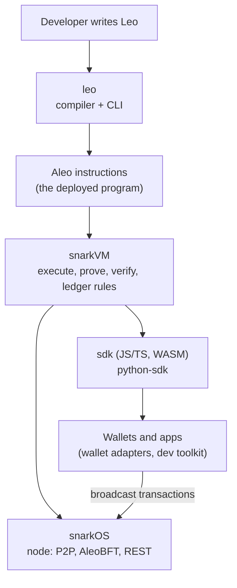

# The Provable / Aleo tech stack

[Provable](https://github.com/ProvableHQ) builds the core software of the [Aleo](https://aleo.org) network: the language developers write, the VM that proves and verifies, the node that runs the chain, and the SDKs apps use. Repository list and activity as of 25 Sep 2026 (`gh repo list ProvableHQ`).

## The stack in one picture

snarkVM is a library used by everything around it: snarkOS (validation, block building), the SDK (proving in the browser), and the Leo CLI (building, running, deploying).

## Core repositories

| Layer | Repo | What it is | Stars | Last push |
| --- | --- | --- | --- | --- |
| Language | [leo](https://github.com/ProvableHQ/leo) | The Leo language, compiler and CLI (`leo build`, `leo run`, `leo deploy`) | 4.8k | 2026-09-17 |
| VM + crypto | [snarkVM](https://github.com/ProvableHQ/snarkVM) | The zkVM: parses programs, synthesizes circuits, Varuna proofs, verification, finalize, ledger rules, storage | 1.2k | 2026-09-24 |
| Node | [snarkOS](https://github.com/ProvableHQ/snarkOS) | The node: validator / client / prover roles, AleoBFT consensus (`node/bft`), REST API (`node/rest`), sync, CDN | 4.5k | 2026-09-24 |
| SDK | [sdk](https://github.com/ProvableHQ/sdk) | JavaScript/TypeScript SDK, snarkVM compiled to WebAssembly | 633 | 2026-09-17 |
| SDK | [python-sdk](https://github.com/ProvableHQ/python-sdk) | Python bindings | 45 | 2026-09-23 |
| Governance | [ARCs](https://github.com/ProvableHQ/ARCs) | Aleo Requests for Comments: protocol and standards proposals | 232 | 2026-09-17 |

## Around the core

| Area | Repos |
| --- | --- |
| Wallets and dApp tooling | [aleo-wallet-adapter](https://github.com/ProvableHQ/aleo-wallet-adapter), [aleo-dev-toolkit](https://github.com/ProvableHQ/aleo-dev-toolkit) (wallet adapter, hooks), [aleo-hd-key](https://github.com/ProvableHQ/aleo-hd-key) |
| Local development | [aleo-devnode](https://github.com/ProvableHQ/aleo-devnode) (standalone dev node), [leo-examples](https://github.com/ProvableHQ/leo-examples), [workshop](https://github.com/ProvableHQ/workshop) |
| Editor support | [leo-lsp-clients](https://github.com/ProvableHQ/leo-lsp-clients), [grammars](https://github.com/ProvableHQ/grammars) |
| Programs and apps | [pondo-programs](https://github.com/ProvableHQ/pondo-programs), [compliant-stablecoin](https://github.com/ProvableHQ/compliant-stablecoin), [hyperlane-aleo](https://github.com/ProvableHQ/hyperlane-aleo), [dynamic-dispatch-example](https://github.com/ProvableHQ/dynamic-dispatch-example) |
| Research and security | [varuna-sage-impl](https://github.com/ProvableHQ/varuna-sage-impl) (SageMath reference implementation of Varuna), [afl_program_tools](https://github.com/ProvableHQ/afl_program_tools) (fuzzing the AleoVM) |
| Explorer | [explorer.provable.com](https://explorer.provable.com) |

## Who runs what

| Actor | Software | snarkVM parts they use |
| --- | --- | --- |
| App developer | Leo CLI, SDK | Parser, circuit synthesis, `deploy`, `execute` |
| User / wallet | Wallet built on the SDK | Keys, `authorize`, `execute` (proving), record decryption |
| Validator | snarkOS (validator) | `check_transaction`, `speculate`, `check_speculate`, `add_next_block` |
| Client / API node | snarkOS (client) | Block verification, storage, REST reads |
| Prover | snarkOS (prover) | Coinbase puzzle (`ledger/puzzle`) |

snarkOS hardware guidance (from its README): validators 64+ cores, 256 GiB RAM, 4 TB NVMe; clients 24+ cores, 128 GiB RAM, 2 TB NVMe.

## Not covered yet

- [ ] snarkOS internals: AleoBFT (Narwhal + Bullshark), sync, REST API
- [ ] Leo: language, compiler pipeline, how it lowers to Aleo instructions
- [ ] SDK: proving in the browser, delegated proving, wallet adapters
- [ ] ARCs worth knowing (token standard, upgrades, redelegation ARC-0049)
